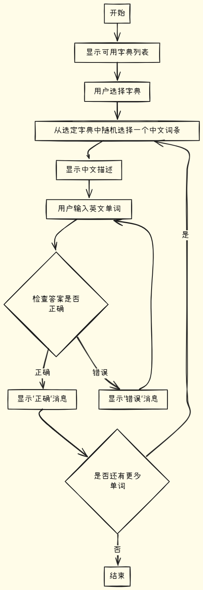

# 介绍

这是一个C++实现的控制台打字软件, 出于教学目的设计。

整个项目会从一个基础的控制台打字软件开始，逐步完善，最终实现一个功能完善的打字软件。项目的目标是通过实现一个打字软件，从中学习巩固C++的知识点。

并且每个版本都会逐步更新到`typeApp[n]`文件夹中。

## 适合人群

- 刚学习完C++基本语法的青少年。


## 项目内容

> 按视频顺序

### 基本
1. 学习使用`Dev-C++`项目化开发;
    - 编辑器和编译器的区别, 源码和可执行文件的区别
    - `.exe`文件说明,环境配置
2. 单词判断逻辑介绍;
    - 字符串比较;
    - 多余空字符摘除;
3. 学会使用`C++`文件操作,中文乱码解决;
    - 编译命令设置`-std=c++11 -finput-charset=GBK`;
    - 数据结构设计;
4. **函数式编程**, 将功能模块化;
    1. 选择词典功能实现;
    2. 数据读取函数实现;
    3. 随机数生成实现;
    4. 中文词条显示实现;
    5. 用户输入实现;
    6. 判断逻辑实现;
5. 使用`struct`,`vector`,`map`等容器;
6. `json`文件介绍,使用`json.hpp`;
    - 将`json.hpp`加入到项目中;
7. 学会创建头文件;
    - 让项目更容易维护;
8. 学会使用ai帮助我们开发项目;

### 进阶
1. `makefile`、`.dev`文件介绍;
2. 使用更专业的代码编辑器`vscode`;
3. `vscode`环境配置（利用dev-c++的编译器和make工具）;
4. `vscode`接入**AI**提高开发效率实现代码自动补全;
5. 控制台输出美化 (颜色、进度条等);
6. 学会使用`git`管理我们的代码;
7. GUI界面设计、面向对象编程、写一个自己的命名空间;

## 流程图

这是最初的程序流程图，随着程序的不断完善和丰富，流程图也会不断更新。



## 环境配置

操作系统：Windows 10/11

编辑器：

- 前期使用dev-c++
- 后期会使用vscode，且vscode使用的编译器和make工具用的都是用dev-c++的。

编辑器设置：

- dev-c++:
    - 添加编译命令`-std=c++11 -finput-charset=GBK`。图先欠着。
    - 项目中添加额外的包含路径, 以确保可以`#include <json.hpp>`导入。视频有讲解。
    ---

- vecode需要配置`.vscode/tasks.json`, 修改`command`处即可。下面是一个示例：
    ```json
    {
        "tasks": [
            {
                "label": "Build with Makefile",
                "type": "shell",
                "command": "d:\\Dev-Cpp\\MinGW64\\bin\\mingw32-make.exe", // 改成你的
                "args": [
                    "-f",
                    "Makefile.win"
                ],
                "options": {
                    "cwd": "${workspaceFolder}/typeApp"
                },
                "group": {
                    "kind": "build",
                    "isDefault": true
                },
                "problemMatcher": [
                    "$gcc"
                ],
                "detail": "使用 Makefile.win 构建项目的任务。"
            }
        ],
        "version": "2.0.0"
    }
    ```
---


# 感谢

本项目的字典数据都是来自[qwerty-learner](https://github.com/RealKai42/qwerty-learner)项目，感谢作者和各路伙伴的开源。